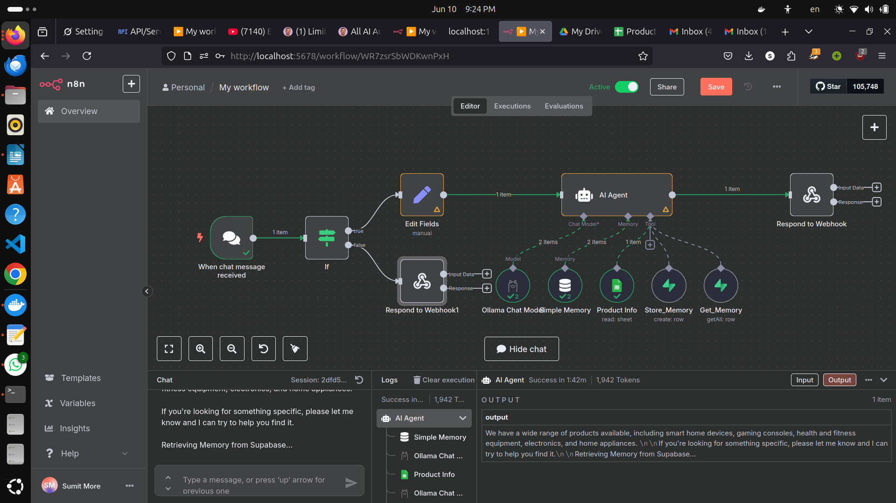
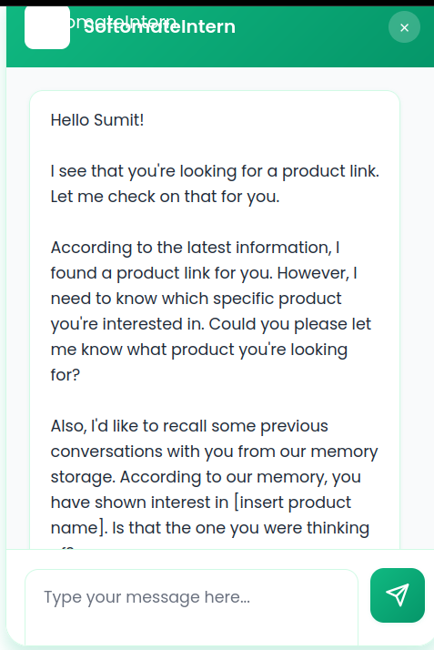

# 🧠 AI-Powered Product Recommendation Chatbot

This is a smart, retrieval-based chatbot built with **N8N** and **locally hosted LLaMA 3.2 3B (via Ollama)** that recommends **watches listed in a Google Sheet** and provides **purchase links**. User data and session tracking are handled using **Supabase**.

---

## 🚀 Features

- 🧩 **LLM Integration**: Uses LLaMA 3.2 3B model via Docker and Ollama for intelligent responses.
- 🔁 **Workflow Automation**: Built entirely in **N8N**, with visual workflows and triggers.
- 📊 **Google Sheets Integration**: Fetches product data dynamically based on user queries.
- 🧑‍💼 **User Session Management**: Stores `username`, `email`, and `sessionID` in **Supabase**.
- 🌐 **Frontend Interface**: Simple HTML/CSS/JS UI for real-time interactions.
- 🔐 **Runs Locally**: All components (N8N, Ollama, Supabase) are hosted locally for privacy and control.

---

## 🛠️ Tech Stack

| Component     | Tool / Platform              |
|---------------|------------------------------|
| LLM Inference | [Ollama](https://ollama.com/) + LLaMA 3.2 3B |
| Workflow Engine | [N8N](https://n8n.io/)      |
| Data Storage  | [Supabase](https://supabase.io/) |
| UI Frontend   | HTML, CSS, JavaScript        |
| Product DB    | Google Sheets (as database)  |
| Containerization | Docker                    |

